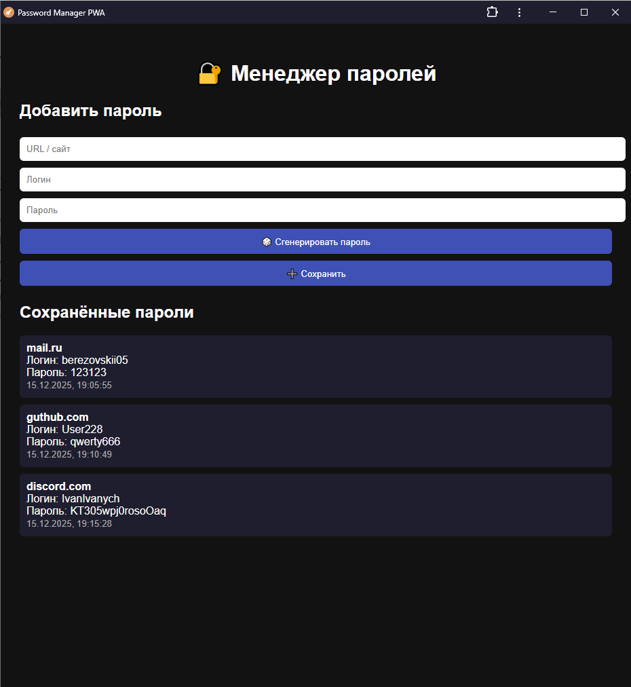
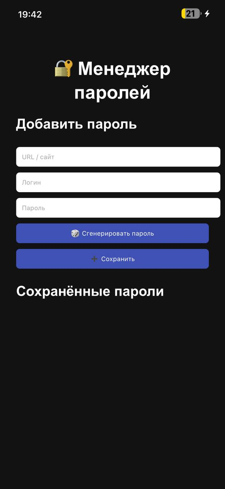

# Password Manager PWA

Веб-приложение (PWA), реализующее простой менеджер паролей с локальным хранением данных в браузере пользователя без использования серверной части.

Приложение поддерживает установку как мобильное приложение и работает в офлайн-режиме.

---

## Онлайн-версия

Приложение доступно по ссылке (GitHub Pages):

👉 https://yunhich.github.io/proglang_lab2/

---

## Возможности приложения

- Просмотр списка сохранённых паролей
- Добавление новых записей (URL / логин / пароль)
- Генерация случайного пароля заданной сложности
- Локальное хранение данных (localStorage)
- Работа без backend
- Поддержка офлайн-режима
- Установка как PWA на ПК и Android

---

## Установка приложения

### ПК (Chrome / Edge)
1. Перейти по ссылке приложения
2. В адресной строке нажать **«Установить приложение»**
3. Подтвердить установку
   

### Android
1. Открыть приложение в браузере **Chrome**
2. Нажать **⋮ → Установить приложение**
3. Приложение появится на главном экране

- На iOS установка возможна через **Safari → Поделиться → Добавить на экран "Домой"**.

